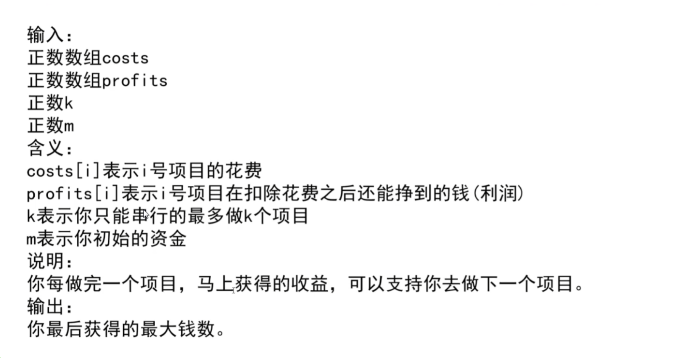

### 贪心算法

在某个标准下，优先考虑最满足标准的样本， 最后考虑最不满足标准的样本， 最终考虑最不满足标准的样本， 最终得到一个答案的算法，
叫做贪心算法

也就是说， 不从整体最优加以考虑，所作出的是在某种意义上的局部最优解

题目1：一些项目要占用一个会议室宣讲，会议室不能同时容纳两个项目的宣讲。给你每一个项目开始的时间和结束的时间。
你来安排宣讲的日程，要求会议室进行的宣讲的场次最多。返回最多的宣讲场次。

**贪心策略：**按结束时间排序，优先选最早结束的会议

### 贪心算法在笔试时的解题套路

1、实现一个不依赖贪心策略的解法X，可以尝试用最暴力的解法
2、脑补出策略A\B\C
3、用解法X和对数器，去验证每个贪心策略，用实验的方式得知那个贪心策略正确
4、不要去纠结贪心策略的证明

题目2：

